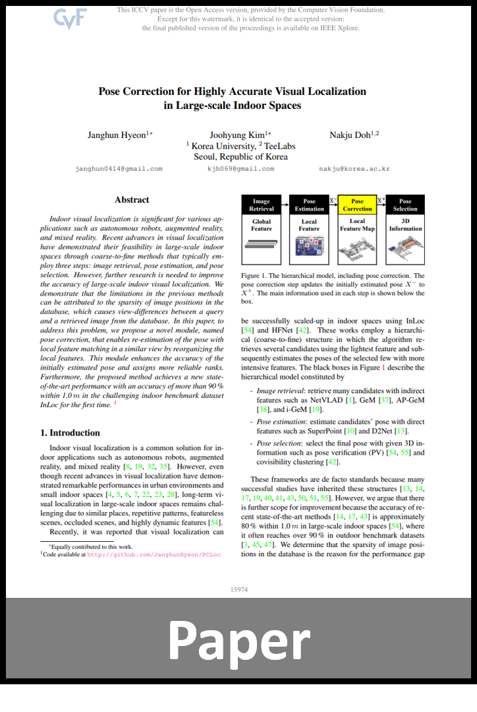
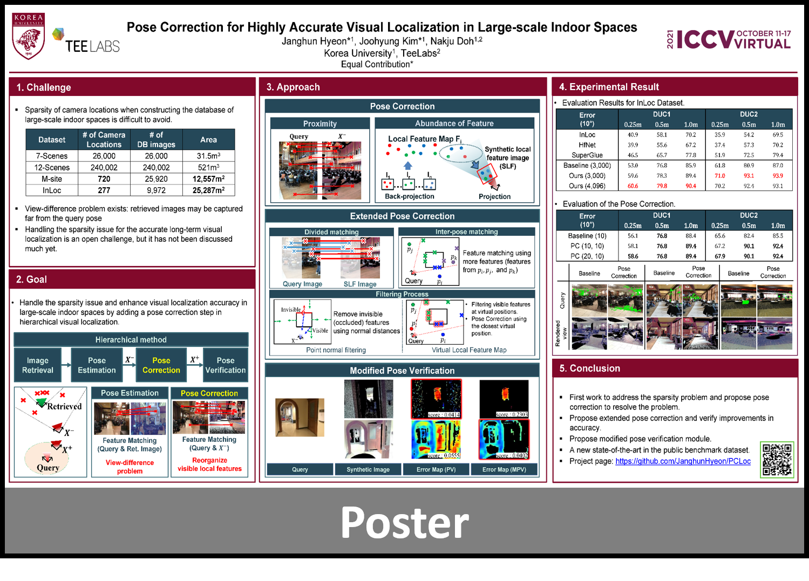
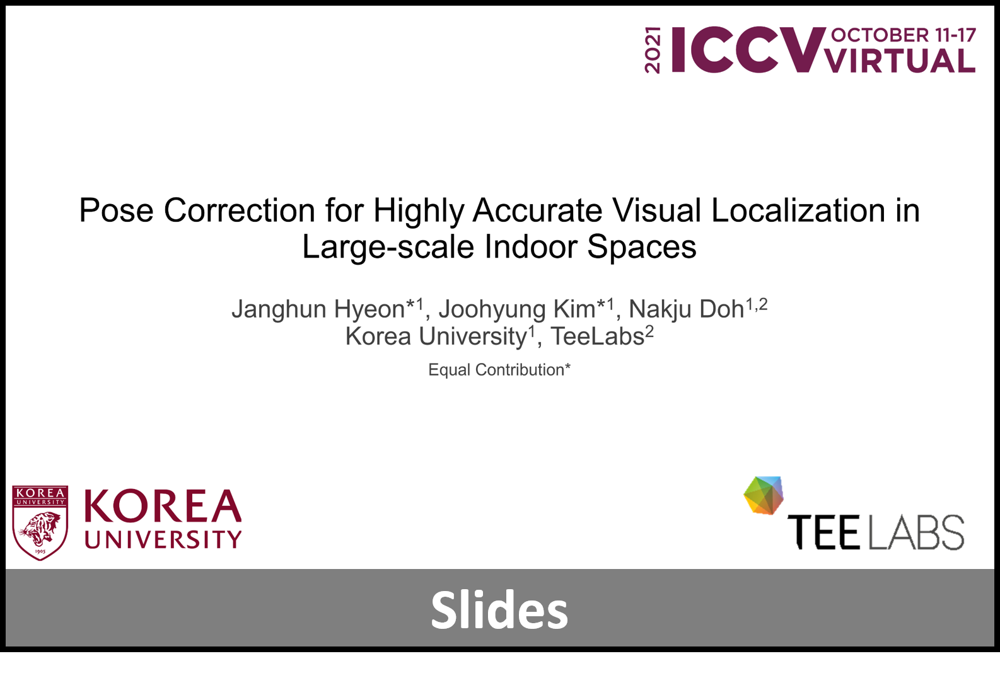
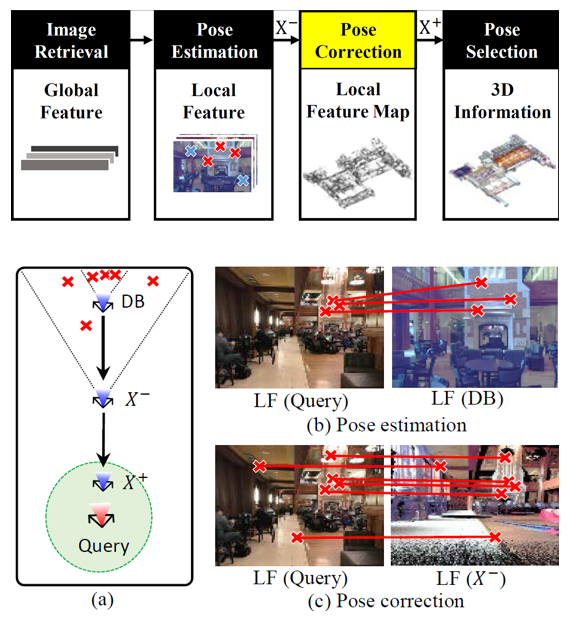
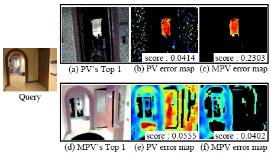
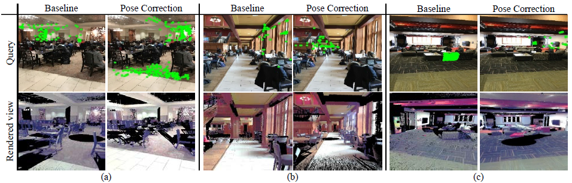

# Pose Correction for Highly Accurate Visual Localization in Large-scale Indoor Spaces (ICCV 2021)

### Janghun Hyeon<sup>1* </sup>, JooHyung Kim<sup>1* </sup>, Nakju Doh<sup>1, 2 </sup>

#### <sup>1</sup> Korea University, <sup>2</sup> TeeLabs
#### * Equally contributed to this work.


​     [](https://openaccess.thecvf.com/content/ICCV2021/html/Hyeon_Pose_Correction_for_Highly_Accurate_Visual_Localization_in_Large-Scale_Indoor_ICCV_2021_paper.html)    [](https://janghunhyeon.github.io/PDF_pages/PCLoc_poster.pdf)    [](https://janghunhyeon.github.io/PDF_pages/PCLoc_slide_upload.pdf) 


---

## Abstract 
Indoor visual localization is significant for various applications such as autonomous robots, augmented reality, and mixed reality. Recent advances in visual localization have demonstrated their feasibility in large-scale indoor spaces through coarse-to-fine methods that typically employ three steps: image retrieval, pose estimation, and pose selection. However, further research is needed to improve the accuracy of large-scale indoor visual localization. We demonstrate that the limitations in the previous methods can be attributed to the sparsity of image positions in the database, which causes view-differences between a query and a retrieved image from the database. In this paper, to address this problem, we propose a novel module, named pose correction, that enables re-estimation of the pose with local feature matching in a similar view by reorganizing the local features. This module enhances the accuracy of the initially estimated pose and assigns more reliable ranks. Furthermore, the proposed method achieves a new state-of-the-art performance with an accuracy of more than 90 %within 1.0 m in the challenging indoor benchmark dataset InLoc for the first time.

<p align="center">

</p>


## Dependencies
* Python 3

* Pytorch >= 1.1

* Tensorflow >= 1.13

* openCV >= 3.4

* Matplotlib >= 3.1

* Numpy >= 1.18

* scipy >= 1.4.1

* open3d >= 0.7.0.0

* vlfeat >= 0.9.20

* vlfeat-ctypes >= 0.1.5


## Prerequisite: Model Parameters
PCLoc is based on coarse-to-fine localization, which uses NetVLAD, SuperPoint, and SuperGlue.
Thus, the model parameter should be downloaded from the original code.

#### NetVLAD: [Download Model](http://rpg.ifi.uzh.ch/datasets/netvlad/vd16_pitts30k_conv5_3_vlad_preL2_intra_white.zip)
Download parameter from the above URL, and unzip the file at: 
```shell
./thirdparty/netvlad_tf/checkpoints/vd16_pitts30k_conv5_3_vlad_preL2_intra_white.data-00000-of-00001
./thirdparty/netvlad_tf/checkpoints/vd16_pitts30k_conv5_3_vlad_preL2_intra_white.index
./thirdparty/netvlad_tf/checkpoints/vd16_pitts30k_conv5_3_vlad_preL2_intra_white.meta
```

#### SuperPoint and SuperGlue: [Download Model](https://github.com/magicleap/SuperGluePretrainedNetwork)

```shell
./thirdparty/SuperGluePretrainedNetwork/models/weights/superglue_outdoor.pth
./thirdparty/SuperGluePretrainedNetwork/models/weights/superpoint_v1.pth
```

## Prerequisite: Dataset

#### **Dataset**

To test our model using the InLoc dataset, the dataset should be downloaded. 
Downloading takes a while (Dataset is about 1.0TB).
[Click here](https://github.com/HajimeTaira/InLoc_dataset) to download dataset.

## Quick Start
* Clone repository
  * `git clone --recurse-submodules https://github.com/JanghunHyeon/PCLoc.git`
* Download InLoc dataset
* Install dependencies
* Download model parameters and unzip the files at each of above path 
* Modify `database_setup.py`
  * line 21 (--db_dir) : path to inloc dataset
  * line 22 (--save_dir) : path to save directory of database features
* Execute `database_setup.py` in python, which prepares database features.
* Modify `main_inference.py`
  * line 39 (--query_dir) : path to query directory.
  * line 40 (--db_dir) : path to database features, which was generated by running `database_setup.py`.
* Execute `main_inference.py` in python, and results are saved at `--log_dir`.


#### **Database Description**

* `netvlad_feats.npy`: Global descriptors (NetVLAD) of the database images.
* `local_feats`: Local features and the corresponding 3D coordinates to the keypoints of each database image.
* `pc_feats`: Local feature map used for the pose correction.
* `scans_npy.npy`: RGB-D scan data from the dataset (InLoc), which is used for pose verification.

## Contents
The provided sample code (`06_main_inference.py`) runs pose correction.
This code provides three options:

* `--opt_div_matching`: Usage of Divided Matching

#### Example: --opt_div_matching
* False: Table 5 (b-1) from the paper
* True: Table 5 (b-2) from the paper


## Results

After running the code, results are shown in the `--log_dir`.


Example: ./log/202103241833/IMG_0738/mpv
* `00_query_img.jpg`: image used for the query.
* `01_final_pose.jpg`: rendered image at the final pose.
* `02_final_err_30.837045.jpg`: error image between the query and the rendered image.
* `pred_IMG_0738.txt`: estimated final pose.
* `all/*`: top-k candidates from the pose correction.

<p align="center">

</p>

<p align="center">

</p>


| Error [*m*, 10<sup>o</sup>] | DUC1 | DUC2 |
| :---:  | :---: | :---: |
| InLoc  | 40.9/ 58.1/ 70.2 | 35.9/ 54.2/ 69.5|
| HFNet  | 39.9/ 55.6/ 67.2 | 37.4/ 57.3/ 70.2|
| KAPTURE| 41.4/ 60.1/ 73.7| 47.3/ 67.2/ 73.3|
| D2Net  | 43.9/ 61.6/ 73.7 | 42.0/ 60.3/ 74.8|
| Oracle | 43.9/ 66.2/ 78.3 | 43.5/ 63.4/ 76.3|
| Sparse NCNet| 47.0/ 67.2/ 79.8| 43.5/ 64.9/ 80.2|
| RLOCS | 47.0/ 71.2/ 84.8| 58.8/ 77.9/ 80.9|
| SuperGlue | 46.5/ 65.7/ 77.8| 51.9/ 72.5/ 79.4|
| **Baseline (3,000)**| 53.0/ 76.8/ 85.9|61.8/ 80.9/ 87.0|
| **Ours (3,000)**| 59.6/ 78.3/ 89.4|**71.0**/ **93.1**/ **93.9**|
| **Ours (4,096)** | **60.6**/ **79.8**/ **90.4**|70.2/ 92.4/ 93.1|

Every evaluation was conudcted with the online viusal localization benchmark server. 
[visuallocalization.net/benchmark](https://www.visuallocalization.net/benchmark)


## BibTeX Citation
If you use any ideas from the paper or code from this repo, please consider citing:

```txt
@inproceedings{hyeon2021pose,
  title={Pose Correction for Highly Accurate Visual Localization in Large-Scale Indoor Spaces},
  author={Hyeon, Janghun and Kim, Joohyung and Doh, Nakju},
  booktitle={Proceedings of the IEEE/CVF International Conference on Computer Vision},
  pages={15974--15983},
  year={2021}
}
```
